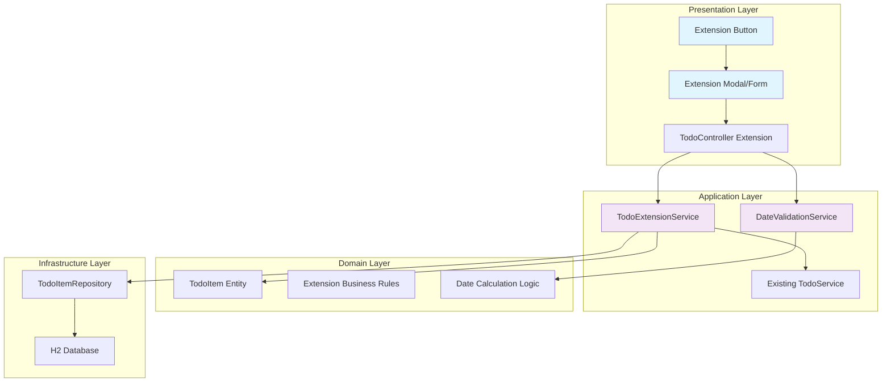

# 設計文件

## 概述

待辦事項延期功能是對現有 Todo List 應用程式的擴展，採用相同的 Clean Architecture 設計原則。此功能專門處理即將到期（三天內）的未完成待辦事項的延期操作，包含前端互動介面、後端業務邏輯、資料驗證和安全控制。

## 架構

### 延期功能架構圖



### 整合現有系統

延期功能將整合到現有的 Todo List 系統中，主要擴展點：

1. **TodoController**: 新增延期相關的端點
2. **TodoService**: 擴展現有服務或建立專門的延期服務
3. **TodoItem Entity**: 可能需要新增延期歷史記錄欄位
4. **前端模板**: 在待辦事項列表中新增延期按鈕和互動介面

## 元件和介面

### 新增服務介面

#### TodoExtensionService Interface
```java
public interface TodoExtensionService {
    /**
     * 檢查待辦事項是否符合延期條件（三天內到期且未完成）
     */
    boolean isEligibleForExtension(TodoItem todoItem);
    
    /**
     * 延期待辦事項
     */
    TodoItem extendTodo(Long todoId, int extensionDays, String username);
    
    /**
     * 取得使用者所有符合延期條件的待辦事項
     */
    List<TodoItem> getEligibleTodosForUser(String username);
    
    /**
     * 驗證延期天數的有效性
     */
    void validateExtensionDays(int extensionDays);
}
```

#### DateValidationService Interface
```java
public interface DateValidationService {
    /**
     * 驗證延期天數（必須為正數）
     */
    boolean isValidExtensionDays(int days);
    
    /**
     * 計算新的到期日
     */
    LocalDate calculateNewDueDate(LocalDate currentDueDate, int extensionDays);
    
    /**
     * 檢查日期是否在指定天數內
     */
    boolean isDueWithinDays(LocalDate dueDate, int days);
    
    /**
     * 驗證跨月日期計算的正確性
     */
    boolean validateCrossMonthCalculation(LocalDate originalDate, LocalDate newDate, int expectedDays);
}
```

### 擴展現有實體

#### TodoItem Entity 擴展
```java
@Entity
@Table(name = "todo_items")
public class TodoItem {
    // 現有欄位...
    
    /**
     * 延期次數記錄
     */
    @Column(name = "extension_count", nullable = false)
    private int extensionCount = 0;
    
    /**
     * 最後延期時間
     */
    @Column(name = "last_extended_at")
    private LocalDateTime lastExtendedAt;
    
    /**
     * 原始到期日（首次設定的到期日）
     */
    @Column(name = "original_due_date")
    private LocalDate originalDueDate;
    
    // 業務邏輯方法
    
    /**
     * 檢查是否符合延期條件
     */
    public boolean isEligibleForExtension() {
        return !this.completed && 
               this.dueDate != null && 
               this.dueDate.isAfter(LocalDate.now().minusDays(1)) && 
               this.dueDate.isBefore(LocalDate.now().plusDays(4));
    }
    
    /**
     * 執行延期操作
     */
    public void extendDueDate(int days) {
        if (days <= 0) {
            throw new IllegalArgumentException("延期天數必須為正數");
        }
        
        // 首次延期時記錄原始到期日
        if (this.originalDueDate == null) {
            this.originalDueDate = this.dueDate;
        }
        
        this.dueDate = this.dueDate.plusDays(days);
        this.extensionCount++;
        this.lastExtendedAt = LocalDateTime.now();
    }
    
    /**
     * 取得總延期天數
     */
    public long getTotalExtensionDays() {
        if (originalDueDate == null) {
            return 0;
        }
        return ChronoUnit.DAYS.between(originalDueDate, dueDate);
    }
}
```

### 新增 DTO 類別

#### ExtendTodoRequest
```java
public class ExtendTodoRequest {
    @NotNull(message = "待辦事項ID不能為空")
    private Long todoId;
    
    @Min(value = 1, message = "延期天數必須為正數")
    @Max(value = 365, message = "延期天數不能超過365天")
    private int extensionDays;
    
    // 建構子、getter、setter
    public ExtendTodoRequest() {}
    
    public ExtendTodoRequest(Long todoId, int extensionDays) {
        this.todoId = todoId;
        this.extensionDays = extensionDays;
    }
    
    // getter 和 setter 方法...
}
```

#### ExtendTodoResponse
```java
public class ExtendTodoResponse {
    private boolean success;
    private String message;
    private LocalDate newDueDate;
    private LocalDate originalDueDate;
    private int totalExtensionDays;
    
    // 建構子
    public ExtendTodoResponse(boolean success, String message) {
        this.success = success;
        this.message = message;
    }
    
    public ExtendTodoResponse(boolean success, String message, 
                            LocalDate newDueDate, LocalDate originalDueDate, 
                            int totalExtensionDays) {
        this.success = success;
        this.message = message;
        this.newDueDate = newDueDate;
        this.originalDueDate = originalDueDate;
        this.totalExtensionDays = totalExtensionDays;
    }
    
    // getter 和 setter 方法...
}
```

### 控制器擴展

#### TodoController 新增端點
```java
@Controller
@RequestMapping("/todos")
public class TodoController {
    
    private final TodoExtensionService extensionService;
    
    /**
     * 顯示延期表單（AJAX 請求）
     */
    @GetMapping("/{id}/extend")
    @ResponseBody
    public ResponseEntity<Map<String, Object>> getExtensionForm(
            @PathVariable Long id, 
            Authentication authentication) {
        
        try {
            TodoItem todo = todoService.findUserTodo(id, authentication.getName())
                .orElseThrow(() -> new TodoNotFoundException("待辦事項不存在"));
            
            if (!extensionService.isEligibleForExtension(todo)) {
                return ResponseEntity.badRequest()
                    .body(Map.of("error", "此待辦事項不符合延期條件"));
            }
            
            Map<String, Object> response = new HashMap<>();
            response.put("todoId", todo.getId());
            response.put("title", todo.getTitle());
            response.put("currentDueDate", todo.getDueDate());
            response.put("maxExtensionDays", 365);
            
            return ResponseEntity.ok(response);
            
        } catch (Exception e) {
            return ResponseEntity.badRequest()
                .body(Map.of("error", e.getMessage()));
        }
    }
    
    /**
     * 處理延期請求
     */
    @PostMapping("/{id}/extend")
    @ResponseBody
    public ResponseEntity<ExtendTodoResponse> extendTodo(
            @PathVariable Long id,
            @Valid @RequestBody ExtendTodoRequest request,
            Authentication authentication) {
        
        try {
            // 驗證請求
            if (!id.equals(request.getTodoId())) {
                return ResponseEntity.badRequest()
                    .body(new ExtendTodoResponse(false, "請求參數不一致"));
            }
            
            // 執行延期
            TodoItem extendedTodo = extensionService.extendTodo(
                id, request.getExtensionDays(), authentication.getName());
            
            ExtendTodoResponse response = new ExtendTodoResponse(
                true, 
                "延期成功",
                extendedTodo.getDueDate(),
                extendedTodo.getOriginalDueDate(),
                (int) extendedTodo.getTotalExtensionDays()
            );
            
            return ResponseEntity.ok(response);
            
        } catch (IllegalArgumentException e) {
            return ResponseEntity.badRequest()
                .body(new ExtendTodoResponse(false, e.getMessage()));
        } catch (Exception e) {
            return ResponseEntity.status(HttpStatus.INTERNAL_SERVER_ERROR)
                .body(new ExtendTodoResponse(false, "系統錯誤，請稍後再試"));
        }
    }
    
    /**
     * 取得延期預覽（計算新日期但不儲存）
     */
    @GetMapping("/{id}/extend/preview")
    @ResponseBody
    public ResponseEntity<Map<String, Object>> previewExtension(
            @PathVariable Long id,
            @RequestParam int days,
            Authentication authentication) {
        
        try {
            TodoItem todo = todoService.findUserTodo(id, authentication.getName())
                .orElseThrow(() -> new TodoNotFoundException("待辦事項不存在"));
            
            // 驗證延期天數
            extensionService.validateExtensionDays(days);
            
            LocalDate newDueDate = dateValidationService.calculateNewDueDate(
                todo.getDueDate(), days);
            
            Map<String, Object> response = new HashMap<>();
            response.put("currentDueDate", todo.getDueDate());
            response.put("newDueDate", newDueDate);
            response.put("extensionDays", days);
            
            return ResponseEntity.ok(response);
            
        } catch (Exception e) {
            return ResponseEntity.badRequest()
                .body(Map.of("error", e.getMessage()));
        }
    }
}
```

## 資料模型

### 資料庫 Schema 擴展

```sql
-- 擴展 todo_items 表，新增延期相關欄位
ALTER TABLE todo_items ADD COLUMN extension_count INT DEFAULT 0;
ALTER TABLE todo_items ADD COLUMN last_extended_at TIMESTAMP NULL;
ALTER TABLE todo_items ADD COLUMN original_due_date DATE NULL;

-- 新增索引以優化查詢效能
CREATE INDEX idx_todo_due_date_completed ON todo_items(due_date, completed);
CREATE INDEX idx_todo_extension_count ON todo_items(extension_count);

-- 更新現有資料，設定 original_due_date 為當前的 due_date
UPDATE todo_items SET original_due_date = due_date WHERE original_due_date IS NULL;
```

### 查詢優化

#### 符合延期條件的待辦事項查詢
```sql
-- 查詢三天內到期且未完成的待辦事項
SELECT * FROM todo_items 
WHERE user_id = ? 
  AND completed = false 
  AND due_date >= CURRENT_DATE 
  AND due_date <= CURRENT_DATE + INTERVAL 3 DAY
ORDER BY due_date ASC;
```

#### JPA Repository 查詢方法
```java
@Repository
public interface TodoItemRepository extends JpaRepository<TodoItem, Long> {
    
    /**
     * 查詢使用者三天內到期且未完成的待辦事項
     */
    @Query("SELECT t FROM TodoItem t WHERE t.user.username = :username " +
           "AND t.completed = false " +
           "AND t.dueDate >= CURRENT_DATE " +
           "AND t.dueDate <= CURRENT_DATE + 3 " +
           "ORDER BY t.dueDate ASC")
    List<TodoItem> findEligibleForExtensionByUsername(@Param("username") String username);
    
    /**
     * 查詢使用者指定日期範圍內的待辦事項
     */
    @Query("SELECT t FROM TodoItem t WHERE t.user.username = :username " +
           "AND t.dueDate BETWEEN :startDate AND :endDate")
    List<TodoItem> findByUserAndDueDateBetween(
        @Param("username") String username,
        @Param("startDate") LocalDate startDate,
        @Param("endDate") LocalDate endDate);
    
    /**
     * 統計使用者的延期次數
     */
    @Query("SELECT SUM(t.extensionCount) FROM TodoItem t WHERE t.user.username = :username")
    Long countTotalExtensionsByUsername(@Param("username") String username);
}
```

## 錯誤處理

### 新增異常類別

#### InvalidExtensionException
```java
public class InvalidExtensionException extends RuntimeException {
    public InvalidExtensionException(String message) {
        super(message);
    }
    
    public InvalidExtensionException(String message, Throwable cause) {
        super(message, cause);
    }
}
```

#### ExtensionNotAllowedException
```java
public class ExtensionNotAllowedException extends RuntimeException {
    private final Long todoId;
    private final String reason;
    
    public ExtensionNotAllowedException(Long todoId, String reason) {
        super(String.format("待辦事項 %d 不允許延期: %s", todoId, reason));
        this.todoId = todoId;
        this.reason = reason;
    }
    
    // getter 方法...
}
```

### 全域異常處理器擴展

```java
@ControllerAdvice
public class GlobalExceptionHandler {
    
    @ExceptionHandler(InvalidExtensionException.class)
    @ResponseBody
    public ResponseEntity<ExtendTodoResponse> handleInvalidExtension(
            InvalidExtensionException ex) {
        return ResponseEntity.badRequest()
            .body(new ExtendTodoResponse(false, ex.getMessage()));
    }
    
    @ExceptionHandler(ExtensionNotAllowedException.class)
    @ResponseBody
    public ResponseEntity<ExtendTodoResponse> handleExtensionNotAllowed(
            ExtensionNotAllowedException ex) {
        return ResponseEntity.badRequest()
            .body(new ExtendTodoResponse(false, ex.getMessage()));
    }
    
    @ExceptionHandler(MethodArgumentNotValidException.class)
    @ResponseBody
    public ResponseEntity<ExtendTodoResponse> handleValidationErrors(
            MethodArgumentNotValidException ex) {
        
        String errorMessage = ex.getBindingResult()
            .getFieldErrors()
            .stream()
            .map(FieldError::getDefaultMessage)
            .collect(Collectors.joining(", "));
            
        return ResponseEntity.badRequest()
            .body(new ExtendTodoResponse(false, "輸入驗證失敗: " + errorMessage));
    }
}
```

## 前端設計

### 延期按鈕和互動介面

#### HTML 模板擴展 (todos/list.html)
```html
<!-- 在待辦事項列表中新增延期按鈕 -->
<div class="todo-item" th:each="todo : ${todos}">
    <div class="todo-content">
        <h3 th:text="${todo.title}">待辦事項標題</h3>
        <p th:text="${todo.description}">描述</p>
        <span class="due-date" th:text="${#temporals.format(todo.dueDate, 'yyyy-MM-dd')}">到期日</span>
    </div>
    
    <div class="todo-actions">
        <!-- 現有按鈕... -->
        
        <!-- 延期按鈕 - 只在符合條件時顯示 -->
        <button th:if="${todo.eligibleForExtension and !todo.completed}" 
                class="btn btn-warning btn-sm extend-btn"
                th:data-todo-id="${todo.id}"
                th:data-todo-title="${todo.title}"
                th:data-current-due-date="${todo.dueDate}">
            <i class="fas fa-clock"></i> 延期
        </button>
    </div>
</div>

<!-- 延期模態框 -->
<div class="modal fade" id="extendModal" tabindex="-1" role="dialog">
    <div class="modal-dialog" role="document">
        <div class="modal-content">
            <div class="modal-header">
                <h5 class="modal-title">延期待辦事項</h5>
                <button type="button" class="close" data-dismiss="modal">
                    <span>&times;</span>
                </button>
            </div>
            <div class="modal-body">
                <form id="extendForm">
                    <div class="form-group">
                        <label>待辦事項：</label>
                        <span id="todoTitle" class="font-weight-bold"></span>
                    </div>
                    
                    <div class="form-group">
                        <label>當前到期日：</label>
                        <span id="currentDueDate" class="text-info"></span>
                    </div>
                    
                    <div class="form-group">
                        <label for="extensionDays">延期天數：</label>
                        <input type="number" 
                               class="form-control" 
                               id="extensionDays" 
                               name="extensionDays" 
                               min="1" 
                               max="365" 
                               required>
                        <div class="invalid-feedback"></div>
                    </div>
                    
                    <!-- 快速選擇按鈕 -->
                    <div class="form-group">
                        <label>快速選擇：</label>
                        <div class="btn-group" role="group">
                            <button type="button" class="btn btn-outline-secondary quick-select" data-days="1">1天</button>
                            <button type="button" class="btn btn-outline-secondary quick-select" data-days="3">3天</button>
                            <button type="button" class="btn btn-outline-secondary quick-select" data-days="7">7天</button>
                            <button type="button" class="btn btn-outline-secondary quick-select" data-days="14">14天</button>
                        </div>
                    </div>
                    
                    <div class="form-group">
                        <label>新到期日：</label>
                        <span id="newDueDate" class="text-success font-weight-bold"></span>
                    </div>
                    
                    <div id="errorMessage" class="alert alert-danger" style="display: none;"></div>
                </form>
            </div>
            <div class="modal-footer">
                <button type="button" class="btn btn-secondary" data-dismiss="modal">取消</button>
                <button type="button" class="btn btn-primary" id="confirmExtend">確認延期</button>
            </div>
        </div>
    </div>
</div>
```

#### JavaScript 互動邏輯
```javascript
// 延期功能的 JavaScript 實作
class TodoExtensionManager {
    constructor() {
        this.currentTodoId = null;
        this.currentDueDate = null;
        this.initEventListeners();
    }
    
    initEventListeners() {
        // 延期按鈕點擊事件
        $(document).on('click', '.extend-btn', (e) => {
            const button = $(e.currentTarget);
            this.openExtensionModal(
                button.data('todo-id'),
                button.data('todo-title'),
                button.data('current-due-date')
            );
        });
        
        // 快速選擇按鈕
        $(document).on('click', '.quick-select', (e) => {
            const days = $(e.currentTarget).data('days');
            $('#extensionDays').val(days);
            this.updatePreview();
        });
        
        // 延期天數輸入變更
        $('#extensionDays').on('input', () => {
            this.updatePreview();
        });
        
        // 確認延期按鈕
        $('#confirmExtend').on('click', () => {
            this.confirmExtension();
        });
    }
    
    openExtensionModal(todoId, title, currentDueDate) {
        this.currentTodoId = todoId;
        this.currentDueDate = currentDueDate;
        
        $('#todoTitle').text(title);
        $('#currentDueDate').text(this.formatDate(currentDueDate));
        $('#extensionDays').val('');
        $('#newDueDate').text('');
        $('#errorMessage').hide();
        
        $('#extendModal').modal('show');
    }
    
    updatePreview() {
        const days = parseInt($('#extensionDays').val());
        
        if (!days || days <= 0) {
            $('#newDueDate').text('');
            return;
        }
        
        // 發送 AJAX 請求取得預覽
        $.get(`/todos/${this.currentTodoId}/extend/preview`, { days: days })
            .done((response) => {
                $('#newDueDate').text(this.formatDate(response.newDueDate));
                this.clearError();
            })
            .fail((xhr) => {
                const error = xhr.responseJSON?.error || '預覽失敗';
                this.showError(error);
            });
    }
    
    confirmExtension() {
        const days = parseInt($('#extensionDays').val());
        
        if (!this.validateInput(days)) {
            return;
        }
        
        const requestData = {
            todoId: this.currentTodoId,
            extensionDays: days
        };
        
        // 發送延期請求
        $.ajax({
            url: `/todos/${this.currentTodoId}/extend`,
            method: 'POST',
            contentType: 'application/json',
            data: JSON.stringify(requestData),
            success: (response) => {
                if (response.success) {
                    $('#extendModal').modal('hide');
                    this.showSuccessMessage('延期成功！');
                    // 重新載入頁面或更新列表
                    location.reload();
                } else {
                    this.showError(response.message);
                }
            },
            error: (xhr) => {
                const error = xhr.responseJSON?.message || '延期失敗，請稍後再試';
                this.showError(error);
            }
        });
    }
    
    validateInput(days) {
        if (!days || days <= 0) {
            this.showError('請輸入有效的延期天數（必須為正數）');
            return false;
        }
        
        if (days > 365) {
            this.showError('延期天數不能超過365天');
            return false;
        }
        
        return true;
    }
    
    showError(message) {
        $('#errorMessage').text(message).show();
    }
    
    clearError() {
        $('#errorMessage').hide();
    }
    
    showSuccessMessage(message) {
        // 可以使用 toast 或其他通知方式
        alert(message);
    }
    
    formatDate(dateString) {
        const date = new Date(dateString);
        return date.toLocaleDateString('zh-TW');
    }
}

// 初始化延期管理器
$(document).ready(() => {
    new TodoExtensionManager();
});
```

### CSS 樣式

```css
/* 延期按鈕樣式 */
.extend-btn {
    background-color: #ffc107;
    border-color: #ffc107;
    color: #212529;
}

.extend-btn:hover {
    background-color: #e0a800;
    border-color: #d39e00;
}

/* 快速選擇按鈕群組 */
.quick-select.active {
    background-color: #007bff;
    color: white;
}

/* 日期顯示樣式 */
.due-date {
    font-size: 0.9em;
    color: #6c757d;
}

.due-date.near-due {
    color: #dc3545;
    font-weight: bold;
}

/* 模態框樣式調整 */
#extendModal .modal-body {
    padding: 1.5rem;
}

#extendModal .form-group label {
    font-weight: 600;
    margin-bottom: 0.5rem;
}

/* 錯誤訊息樣式 */
.invalid-feedback {
    display: block;
}
```

## 測試策略

### 單元測試設計

#### TodoExtensionService 測試
```java
@ExtendWith(MockitoExtension.class)
class TodoExtensionServiceTest {
    
    @Mock
    private TodoItemRepository todoItemRepository;
    
    @Mock
    private UserRepository userRepository;
    
    @Mock
    private DateValidationService dateValidationService;
    
    @InjectMocks
    private TodoExtensionServiceImpl extensionService;
    
    @Test
    @DisplayName("符合條件的待辦事項應該可以延期")
    void test_isEligibleForExtension_whenTodoIsIncompleteDueWithinThreeDays_then_shouldReturnTrue() {
        // Given
        TodoItem todo = new TodoItem();
        todo.setCompleted(false);
        todo.setDueDate(LocalDate.now().plusDays(2)); // 兩天後到期
        
        // When
        boolean result = extensionService.isEligibleForExtension(todo);
        
        // Then
        assertTrue(result);
    }
    
    @Test
    @DisplayName("已完成的待辦事項不應該可以延期")
    void test_isEligibleForExtension_whenTodoIsCompleted_then_shouldReturnFalse() {
        // Given
        TodoItem todo = new TodoItem();
        todo.setCompleted(true);
        todo.setDueDate(LocalDate.now().plusDays(1));
        
        // When
        boolean result = extensionService.isEligibleForExtension(todo);
        
        // Then
        assertFalse(result);
    }
    
    @Test
    @DisplayName("延期天數為負數時應該拋出異常")
    void test_validateExtensionDays_whenNegativeDays_then_shouldThrowException() {
        // Given
        int negativeDays = -5;
        
        // When & Then
        assertThrows(InvalidExtensionException.class, 
            () -> extensionService.validateExtensionDays(negativeDays));
    }
    
    @Test
    @DisplayName("成功延期後應該更新到期日和延期記錄")
    void test_extendTodo_whenValidRequest_then_shouldUpdateDueDateAndExtensionRecord() {
        // Given
        User user = new User("testuser", "password");
        TodoItem todo = new TodoItem("測試任務", "描述", LocalDate.now().plusDays(1));
        todo.setUser(user);
        
        when(todoItemRepository.findByIdAndUser_Username(1L, "testuser"))
            .thenReturn(Optional.of(todo));
        when(dateValidationService.calculateNewDueDate(any(), eq(3)))
            .thenReturn(LocalDate.now().plusDays(4));
        when(todoItemRepository.save(any(TodoItem.class)))
            .thenReturn(todo);
        
        // When
        TodoItem result = extensionService.extendTodo(1L, 3, "testuser");
        
        // Then
        assertEquals(LocalDate.now().plusDays(4), result.getDueDate());
        assertEquals(1, result.getExtensionCount());
        assertNotNull(result.getLastExtendedAt());
        verify(todoItemRepository).save(todo);
    }
}
```

#### DateValidationService 測試
```java
@ExtendWith(MockitoExtension.class)
class DateValidationServiceTest {
    
    private DateValidationService dateValidationService;
    
    @BeforeEach
    void setUp() {
        dateValidationService = new DateValidationServiceImpl();
    }
    
    @Test
    @DisplayName("正數延期天數應該通過驗證")
    void test_isValidExtensionDays_whenPositiveDays_then_shouldReturnTrue() {
        // Given
        int positiveDays = 5;
        
        // When
        boolean result = dateValidationService.isValidExtensionDays(positiveDays);
        
        // Then
        assertTrue(result);
    }
    
    @Test
    @DisplayName("零或負數延期天數應該不通過驗證")
    void test_isValidExtensionDays_whenZeroOrNegativeDays_then_shouldReturnFalse() {
        // Given & When & Then
        assertFalse(dateValidationService.isValidExtensionDays(0));
        assertFalse(dateValidationService.isValidExtensionDays(-1));
        assertFalse(dateValidationService.isValidExtensionDays(-10));
    }
    
    @Test
    @DisplayName("跨月延期應該正確計算新日期")
    void test_calculateNewDueDate_whenCrossMonth_then_shouldCalculateCorrectly() {
        // Given
        LocalDate currentDate = LocalDate.of(2024, 1, 30); // 1月30日
        int extensionDays = 5;
        
        // When
        LocalDate newDate = dateValidationService.calculateNewDueDate(currentDate, extensionDays);
        
        // Then
        LocalDate expectedDate = LocalDate.of(2024, 2, 4); // 2月4日
        assertEquals(expectedDate, newDate);
    }
    
    @Test
    @DisplayName("閏年2月29日延期應該正確處理")
    void test_calculateNewDueDate_whenLeapYearFebruary29_then_shouldHandleCorrectly() {
        // Given
        LocalDate leapYearDate = LocalDate.of(2024, 2, 29); // 2024年是閏年
        int extensionDays = 1;
        
        // When
        LocalDate newDate = dateValidationService.calculateNewDueDate(leapYearDate, extensionDays);
        
        // Then
        LocalDate expectedDate = LocalDate.of(2024, 3, 1); // 3月1日
        assertEquals(expectedDate, newDate);
    }
    
    @Test
    @DisplayName("檢查三天內到期應該正確判斷")
    void test_isDueWithinDays_whenWithinThreeDays_then_shouldReturnTrue() {
        // Given
        LocalDate today = LocalDate.now();
        LocalDate tomorrow = today.plusDays(1);
        LocalDate dayAfterTomorrow = today.plusDays(2);
        LocalDate threeDaysLater = today.plusDays(3);
        LocalDate fourDaysLater = today.plusDays(4);
        
        // When & Then
        assertTrue(dateValidationService.isDueWithinDays(today, 3));
        assertTrue(dateValidationService.isDueWithinDays(tomorrow, 3));
        assertTrue(dateValidationService.isDueWithinDays(dayAfterTomorrow, 3));
        assertTrue(dateValidationService.isDueWithinDays(threeDaysLater, 3));
        assertFalse(dateValidationService.isDueWithinDays(fourDaysLater, 3));
    }
}
```

#### TodoItem Entity 測試
```java
class TodoItemTest {
    
    @Test
    @DisplayName("未完成且三天內到期的待辦事項應該符合延期條件")
    void test_isEligibleForExtension_whenIncompleteAndDueWithinThreeDays_then_shouldReturnTrue() {
        // Given
        TodoItem todo = new TodoItem("測試任務", "描述", LocalDate.now().plusDays(2));
        todo.setCompleted(false);
        
        // When
        boolean result = todo.isEligibleForExtension();
        
        // Then
        assertTrue(result);
    }
    
    @Test
    @DisplayName("已完成的待辦事項不應該符合延期條件")
    void test_isEligibleForExtension_whenCompleted_then_shouldReturnFalse() {
        // Given
        TodoItem todo = new TodoItem("測試任務", "描述", LocalDate.now().plusDays(1));
        todo.setCompleted(true);
        
        // When
        boolean result = todo.isEligibleForExtension();
        
        // Then
        assertFalse(result);
    }
    
    @Test
    @DisplayName("延期操作應該正確更新到期日和延期記錄")
    void test_extendDueDate_whenValidDays_then_shouldUpdateDueDateAndExtensionRecord() {
        // Given
        LocalDate originalDueDate = LocalDate.now().plusDays(1);
        TodoItem todo = new TodoItem("測試任務", "描述", originalDueDate);
        int extensionDays = 3;
        
        // When
        todo.extendDueDate(extensionDays);
        
        // Then
        assertEquals(originalDueDate.plusDays(extensionDays), todo.getDueDate());
        assertEquals(originalDueDate, todo.getOriginalDueDate());
        assertEquals(1, todo.getExtensionCount());
        assertNotNull(todo.getLastExtendedAt());
    }
    
    @Test
    @DisplayName("延期天數為負數時應該拋出異常")
    void test_extendDueDate_whenNegativeDays_then_shouldThrowException() {
        // Given
        TodoItem todo = new TodoItem("測試任務", "描述", LocalDate.now().plusDays(1));
        int negativeDays = -1;
        
        // When & Then
        assertThrows(IllegalArgumentException.class, 
            () -> todo.extendDueDate(negativeDays));
    }
    
    @Test
    @DisplayName("多次延期應該累計延期次數和總天數")
    void test_multipleExtensions_whenExtendedMultipleTimes_then_shouldAccumulateCountAndDays() {
        // Given
        LocalDate originalDueDate = LocalDate.now().plusDays(1);
        TodoItem todo = new TodoItem("測試任務", "描述", originalDueDate);
        
        // When
        todo.extendDueDate(2); // 第一次延期2天
        todo.extendDueDate(3); // 第二次延期3天
        
        // Then
        assertEquals(originalDueDate.plusDays(5), todo.getDueDate()); // 總共延期5天
        assertEquals(originalDueDate, todo.getOriginalDueDate()); // 原始日期不變
        assertEquals(2, todo.getExtensionCount()); // 延期次數為2
        assertEquals(5, todo.getTotalExtensionDays()); // 總延期天數為5
    }
}
```

### 整合測試設計

#### Controller 整合測試
```java
@WebMvcTest(TodoController.class)
class TodoControllerExtensionTest {
    
    @Autowired
    private MockMvc mockMvc;
    
    @MockBean
    private TodoService todoService;
    
    @MockBean
    private TodoExtensionService extensionService;
    
    @Test
    @DisplayName("延期請求成功時應該回傳成功回應")
    void test_extendTodo_whenValidRequest_then_shouldReturnSuccessResponse() throws Exception {
        // Given
        TodoItem extendedTodo = new TodoItem("測試任務", "描述", LocalDate.now().plusDays(4));
        extendedTodo.setId(1L);
        
        when(extensionService.extendTodo(1L, 3, "testuser"))
            .thenReturn(extendedTodo);
        
        // When & Then
        mockMvc.perform(post("/todos/1/extend")
                .contentType(MediaType.APPLICATION_JSON)
                .content("{\"todoId\":1,\"extensionDays\":3}")
                .with(user("testuser")))
            .andExpect(status().isOk())
            .andExpect(jsonPath("$.success").value(true))
            .andExpect(jsonPath("$.message").value("延期成功"))
            .andExpect(jsonPath("$.newDueDate").exists());
    }
    
    @Test
    @DisplayName("延期天數為負數時應該回傳錯誤回應")
    void test_extendTodo_whenNegativeDays_then_shouldReturnErrorResponse() throws Exception {
        // When & Then
        mockMvc.perform(post("/todos/1/extend")
                .contentType(MediaType.APPLICATION_JSON)
                .content("{\"todoId\":1,\"extensionDays\":-1}")
                .with(user("testuser")))
            .andExpect(status().isBadRequest())
            .andExpect(jsonPath("$.success").value(false))
            .andExpect(jsonPath("$.message").value(containsString("延期天數必須為正數")));
    }
}
```

### 測試覆蓋率目標

- **單元測試覆蓋率**: 85% 以上
- **整合測試覆蓋率**: 70% 以上
- **端到端測試**: 涵蓋主要使用者流程

## 安全性考量

### 權限驗證
- **使用者隔離**: 確保使用者只能延期自己的待辦事項
- **Spring Security 整合**: 使用現有的認證機制
- **CSRF 保護**: AJAX 請求包含 CSRF Token

### 輸入驗證
- **前端驗證**: JavaScript 即時驗證
- **後端驗證**: Bean Validation 和業務邏輯驗證
- **SQL 注入防護**: 使用 JPA 參數化查詢

### 錯誤處理
- **敏感資訊保護**: 不洩露系統內部資訊
- **統一錯誤格式**: 一致的錯誤回應格式
- **日誌記錄**: 記錄安全相關事件

## 效能優化

### 資料庫優化
- **索引策略**: 在 due_date 和 completed 欄位建立複合索引
- **查詢優化**: 使用高效的 JPA 查詢
- **批次處理**: 如需要，支援批次延期操作

### 前端優化
- **AJAX 快取**: 快取延期預覽結果
- **防抖動**: 延期天數輸入的防抖動處理
- **載入狀態**: 提供視覺化的載入回饋

### 記憶體管理
- **物件重用**: 重用 DTO 物件
- **垃圾回收**: 適當的物件生命週期管理