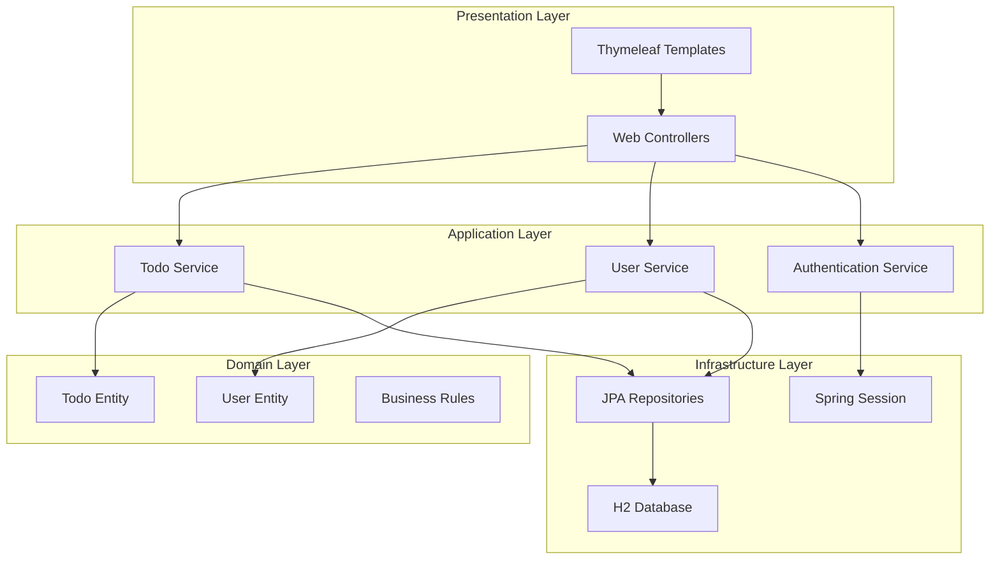

# 設計文件

## 概述

Todo List 應用程式採用 Clean Architecture 設計原則，使用 Spring Boot 3.5.6 框架開發。系統分為四個主要層次：Presentation Layer（控制器和視圖）、Application Layer（服務層）、Domain Layer（實體和業務邏輯）、Infrastructure Layer（資料存取和外部服務）。

## 架構

### 整體架構圖



### 分層架構詳細說明

#### 1. Presentation Layer (表現層)
- **Web Controllers**: 處理 HTTP 請求和回應
- **Thymeleaf Templates**: 動態 HTML 頁面生成
- **Form DTOs**: 資料傳輸物件，用於表單綁定

#### 2. Application Layer (應用層)
- **Service Classes**: 封裝業務邏輯和用例
- **Transaction Management**: 確保資料一致性
- **Validation**: 輸入資料驗證

#### 3. Domain Layer (領域層)
- **Entities**: 核心業務實體
- **Value Objects**: 不可變的值物件
- **Domain Services**: 領域特定的業務邏輯

#### 4. Infrastructure Layer (基礎設施層)
- **JPA Repositories**: 資料存取抽象
- **Database Configuration**: H2 資料庫設定
- **Session Management**: Spring Session 配置

## 元件和介面

### 核心實體設計

#### User Entity
```java
@Entity
@Table(name = "users")
public class User {
    @Id
    @GeneratedValue(strategy = GenerationType.IDENTITY)
    private Long id;
    
    @Column(unique = true, nullable = false)
    private String username;
    
    @Column(nullable = false)
    private String password;
    
    @OneToMany(mappedBy = "user", cascade = CascadeType.ALL, fetch = FetchType.LAZY)
    private List<TodoItem> todoItems;
    
    @CreationTimestamp
    private LocalDateTime createdAt;
}
```

#### TodoItem Entity
```java
@Entity
@Table(name = "todo_items")
public class TodoItem {
    @Id
    @GeneratedValue(strategy = GenerationType.IDENTITY)
    private Long id;
    
    @Column(nullable = false)
    private String title;
    
    @Column(length = 1000)
    private String description;
    
    @Column(nullable = false)
    private boolean completed = false;
    
    @CreationTimestamp
    private LocalDateTime createdAt;
    
    @Column(nullable = false)
    private LocalDate dueDate;
    
    private LocalDateTime completedAt;
    
    @ManyToOne(fetch = FetchType.LAZY)
    @JoinColumn(name = "user_id", nullable = false)
    private User user;
}
```

### 服務層介面

#### TodoService Interface
```java
public interface TodoService {
    TodoItem createTodo(CreateTodoRequest request, String username);
    List<TodoItem> getUserTodos(String username, SortBy sortBy);
    TodoItem updateTodo(Long todoId, UpdateTodoRequest request, String username);
    void deleteTodo(Long todoId, String username);
    TodoItem toggleComplete(Long todoId, String username);
    Optional<TodoItem> findUserTodo(Long todoId, String username);
}
```

#### UserService Interface
```java
public interface UserService {
    User createUser(String username, String password);
    Optional<User> findByUsername(String username);
    boolean validatePassword(String username, String password);
}
```

### 控制器設計

#### TodoController
- `GET /todos` - 顯示待辦事項列表
- `GET /todos/new` - 顯示新增待辦事項表單
- `POST /todos` - 建立新待辦事項
- `GET /todos/{id}/edit` - 顯示編輯表單
- `PUT /todos/{id}` - 更新待辦事項
- `DELETE /todos/{id}` - 刪除待辦事項
- `POST /todos/{id}/toggle` - 切換完成狀態

#### AuthController
- `GET /login` - 顯示登入頁面
- `POST /login` - 處理登入請求
- `GET /register` - 顯示註冊頁面
- `POST /register` - 處理註冊請求
- `POST /logout` - 處理登出請求

## 資料模型

### 資料庫 Schema

```sql
-- Users 表
CREATE TABLE users (
    id BIGINT AUTO_INCREMENT PRIMARY KEY,
    username VARCHAR(50) UNIQUE NOT NULL,
    password VARCHAR(255) NOT NULL,
    created_at TIMESTAMP DEFAULT CURRENT_TIMESTAMP
);

-- Todo Items 表
CREATE TABLE todo_items (
    id BIGINT AUTO_INCREMENT PRIMARY KEY,
    title VARCHAR(255) NOT NULL,
    description TEXT,
    completed BOOLEAN DEFAULT FALSE,
    created_at TIMESTAMP DEFAULT CURRENT_TIMESTAMP,
    due_date DATE NOT NULL,
    completed_at TIMESTAMP NULL,
    user_id BIGINT NOT NULL,
    FOREIGN KEY (user_id) REFERENCES users(id) ON DELETE CASCADE
);

-- 索引優化
CREATE INDEX idx_todo_user_id ON todo_items(user_id);
CREATE INDEX idx_todo_created_at ON todo_items(created_at);
CREATE INDEX idx_todo_due_date ON todo_items(due_date);
```

### DTO 設計

#### CreateTodoRequest
```java
public class CreateTodoRequest {
    @NotBlank(message = "標題不能為空")
    @Size(max = 255, message = "標題長度不能超過255字元")
    private String title;
    
    @Size(max = 1000, message = "描述長度不能超過1000字元")
    private String description;
    
    @NotNull(message = "預計完成日不能為空")
    @Future(message = "預計完成日必須是未來日期")
    private LocalDate dueDate;
}
```

#### UpdateTodoRequest
```java
public class UpdateTodoRequest {
    @NotBlank(message = "標題不能為空")
    @Size(max = 255, message = "標題長度不能超過255字元")
    private String title;
    
    @Size(max = 1000, message = "描述長度不能超過1000字元")
    private String description;
    
    @NotNull(message = "預計完成日不能為空")
    private LocalDate dueDate;
}
```

## 錯誤處理

### 全域異常處理器
```java
@ControllerAdvice
public class GlobalExceptionHandler {
    
    @ExceptionHandler(TodoNotFoundException.class)
    public String handleTodoNotFound(TodoNotFoundException ex, Model model) {
        model.addAttribute("error", "找不到指定的待辦事項");
        return "error/404";
    }
    
    @ExceptionHandler(UnauthorizedAccessException.class)
    public String handleUnauthorizedAccess(UnauthorizedAccessException ex, Model model) {
        model.addAttribute("error", "您沒有權限存取此資源");
        return "error/403";
    }
    
    @ExceptionHandler(ValidationException.class)
    public String handleValidation(ValidationException ex, Model model) {
        model.addAttribute("error", ex.getMessage());
        return "redirect:/todos";
    }
}
```

### 自定義異常類別
- `TodoNotFoundException`: 待辦事項不存在
- `UnauthorizedAccessException`: 未授權存取
- `UserAlreadyExistsException`: 使用者已存在
- `InvalidCredentialsException`: 登入憑證無效

## 測試策略

### 測試金字塔

#### 1. 單元測試 (Unit Tests)
- **Entity Tests**: 測試實體驗證規則和業務邏輯，不依賴外部資源
- **Service Layer Tests**: 使用 Mockito 模擬依賴，測試業務邏輯
- **Repository Tests**: 測試資料存取層，使用 @DataJpaTest
- **覆蓋率目標**: 80% 以上

#### 測試方法命名規範
所有測試方法必須遵循以下命名格式：
```
test_<method>_when<situation>_then_<test_result>
```

**命名規則說明：**
- `<method>`: 被測試的方法名稱
- `<situation>`: 測試的情境或條件
- `<test_result>`: 預期的測試結果

**範例：**
```java
// 測試實體方法
test_setCompleted_whenSetToTrue_then_shouldSetCompletedAtAutomatically()
test_isOverdue_whenDueDateIsPast_then_shouldReturnTrue()
test_addTodoItem_whenValidTodoItem_then_shouldAddToListAndSetUser()

// 測試服務方法
test_createTodo_whenValidRequest_then_shouldReturnSavedTodoItem()
test_findUserTodo_whenTodoNotExists_then_shouldReturnEmpty()
test_deleteTodo_whenUnauthorizedUser_then_shouldThrowException()

// 測試控制器方法
test_getTodos_whenUserAuthenticated_then_shouldReturnTodoListView()
test_createTodo_whenInvalidData_then_shouldReturnFormWithErrors()
```

#### 2. 整合測試 (Integration Tests)
- **Controller Tests**: 使用 @WebMvcTest 和 Mockito 模擬服務層
- **Repository Integration Tests**: 使用 @DataJpaTest 測試實際資料庫操作
- **Service Integration Tests**: 使用 @SpringBootTest 測試完整的服務層整合

#### 3. 端到端測試 (E2E Tests)
- **Web Layer Tests**: 完整的 HTTP 請求流程
- **Database Integration**: 實際資料庫操作測試

### Mockito 測試框架使用

#### Maven 依賴配置
Mockito 已包含在 `spring-boot-starter-test` 依賴中，無需額外配置：
```xml
<dependency>
    <groupId>org.springframework.boot</groupId>
    <artifactId>spring-boot-starter-test</artifactId>
    <scope>test</scope>
</dependency>
```

#### 單元測試最佳實踐
- **Entity Tests**: 純 POJO 測試，不使用 Mock，專注於業務邏輯和驗證規則
- **Service Tests**: 使用 @Mock 和 @InjectMocks 隔離測試業務邏輯
- **Controller Tests**: 使用 @MockBean 模擬服務層依賴

#### Mock 策略
```java
// Service 層測試範例
@ExtendWith(MockitoExtension.class)
class TodoServiceTest {
    @Mock
    private TodoItemRepository todoItemRepository;
    
    @Mock
    private UserRepository userRepository;
    
    @InjectMocks
    private TodoServiceImpl todoService;
    
    @Test
    @DisplayName("建立待辦事項時應該儲存並回傳待辦事項")
    void test_createTodo_whenValidRequest_then_shouldSaveAndReturnTodoItem() {
        // Given
        when(userRepository.findByUsername("testuser"))
            .thenReturn(Optional.of(mockUser));
        when(todoItemRepository.save(any(TodoItem.class)))
            .thenReturn(mockTodoItem);
        
        // When & Then
        // 測試邏輯
    }
    
    @Test
    @DisplayName("使用者不存在時應該拋出異常")
    void test_createTodo_whenUserNotExists_then_shouldThrowUserNotFoundException() {
        // Given
        when(userRepository.findByUsername("nonexistent"))
            .thenReturn(Optional.empty());
        
        // When & Then
        assertThrows(UserNotFoundException.class, 
            () -> todoService.createTodo(request, "nonexistent"));
    }
}
```

#### Controller 測試範例
```java
@WebMvcTest(TodoController.class)
class TodoControllerTest {
    @Autowired
    private MockMvc mockMvc;
    
    @MockBean
    private TodoService todoService;
    
    @Test
    void shouldReturnTodoList() throws Exception {
        // Given
        when(todoService.getUserTodos(anyString(), any()))
            .thenReturn(mockTodoList);
        
        // When & Then
        mockMvc.perform(get("/todos"))
            .andExpect(status().isOk())
            .andExpect(model().attributeExists("todos"));
    }
}
```

#### Controller 測試範例
```java
@WebMvcTest(TodoController.class)
class TodoControllerTest {
    @Autowired
    private MockMvc mockMvc;
    
    @MockBean
    private TodoService todoService;
    
    @Test
    @DisplayName("使用者已認證時應該回傳待辦事項列表頁面")
    void test_getTodos_whenUserAuthenticated_then_shouldReturnTodoListView() throws Exception {
        // Given
        when(todoService.getUserTodos(anyString(), any()))
            .thenReturn(mockTodoList);
        
        // When & Then
        mockMvc.perform(get("/todos"))
            .andExpect(status().isOk())
            .andExpect(model().attributeExists("todos"))
            .andExpect(view().name("todos/list"));
    }
    
    @Test
    @DisplayName("建立待辦事項時資料無效應該回傳表單並顯示錯誤")
    void test_createTodo_whenInvalidData_then_shouldReturnFormWithErrors() throws Exception {
        // When & Then
        mockMvc.perform(post("/todos")
                .param("title", "") // 空標題
                .param("description", "測試描述")
                .param("dueDate", "2024-10-25"))
            .andExpect(status().isOk())
            .andExpect(model().hasErrors())
            .andExpect(view().name("todos/form"));
    }
}
```

### 測試資料管理
- **單元測試**: 使用 Mockito 建立測試替身，不依賴實際資料
- **整合測試**: 使用 @Sql 註解載入測試資料
- **測試隔離**: 每個測試方法後清理資料
- **測試容器**: 使用 TestContainers 進行隔離的整合測試

## 安全性考量

### 認證和授權
- **Session-based Authentication**: 使用 Spring Session
- **Password Encoding**: 使用 BCrypt 加密密碼
- **CSRF Protection**: 啟用 CSRF 保護
- **Session Timeout**: 設定適當的會話超時時間

### 資料驗證
- **Input Validation**: 使用 Bean Validation
- **SQL Injection Prevention**: 使用 JPA 參數化查詢
- **XSS Prevention**: Thymeleaf 自動轉義

### 存取控制
- **User Isolation**: 確保使用者只能存取自己的資料
- **Method-level Security**: 在服務層實施安全檢查

## 效能優化

### 資料庫優化
- **Lazy Loading**: 使用延遲載入減少不必要的查詢
- **Indexing**: 在常用查詢欄位建立索引
- **Connection Pooling**: 使用 HikariCP 連線池

### 快取策略
- **Session Caching**: Spring Session 快取使用者會話
- **Query Caching**: JPA 二級快取（如需要）

### 分頁處理
- **Pagination**: 使用 Spring Data 分頁功能
- **Sorting**: 支援多欄位排序

## 部署配置

### 環境配置
```yaml
# application.yml
spring:
  datasource:
    url: jdbc:h2:mem:todoapp
    driver-class-name: org.h2.Driver
    username: sa
    password: 
  
  h2:
    console:
      enabled: true
      path: /h2-console
  
  jpa:
    hibernate:
      ddl-auto: create-drop
    show-sql: true
    properties:
      hibernate:
        format_sql: true
  
  session:
    store-type: jdbc
    timeout: 30m
  
  thymeleaf:
    cache: false
    mode: HTML
```

### 初始資料載入

#### 預設測試帳號
- **主要測試帳號**: chienlin / 1234
- **其他測試帳號**: 
  - alice / password123
  - bob / mypass456
  - carol / test789

#### 測試資料結構
```sql
-- 預設使用者（密碼使用 BCrypt 加密）
INSERT INTO users (username, password, created_at) VALUES 
('chienlin', '$2a$10$N.zmdr9k7uOsxVQDApz2lOIhK6s.L0LGst1/pjYzpwRwHgYqxkHvC', '2024-10-15 08:00:00'),
('alice', '$2a$10$8K1p/wf5YE29/Mpep.Vije.Ry/8Nc/YvGLLR/.fOn8Us5ssVdtlRO', '2024-10-16 09:30:00'),
('bob', '$2a$10$Xl0yhvzLIuyg1yI6k2uAuOUmieWyafgq5/OjqiQab7CoQk6eOqSRy', '2024-10-17 10:15:00'),
('carol', '$2a$10$5/Kw8/8F.nqy6B8KvQf5..QJ9FbNx/8qVQy5B8KvQf5..QJ9FbNx8', '2024-10-18 11:45:00');

-- chienlin 的待辦事項（涵蓋不同狀態和日期）
INSERT INTO todo_items (title, description, completed, created_at, due_date, completed_at, user_id) VALUES 
('完成專案提案', '準備下週一的專案提案簡報，包含需求分析和時程規劃', false, '2024-10-20 09:00:00', '2024-10-25', null, 1),
('購買生活用品', '到超市購買洗髮精、牙膏、衛生紙等日用品', false, '2024-10-21 14:30:00', '2024-10-23', null, 1),
('學習 Spring Boot', '完成 Spring Boot 官方教學文件的閱讀', true, '2024-10-18 10:15:00', '2024-10-22', '2024-10-22 16:45:00', 1),
('健康檢查預約', '預約年度健康檢查，包含血液檢查和X光檢查', false, '2024-10-19 11:20:00', '2024-10-30', null, 1),
('整理書房', '整理書房的書籍和文件，丟棄不需要的資料', true, '2024-10-17 08:00:00', '2024-10-20', '2024-10-20 15:30:00', 1),
('準備面試', '準備技術面試的常見問題和專案經驗分享', false, '2024-10-22 13:45:00', '2024-10-28', null, 1),
('閱讀技術書籍', '閱讀《Clean Code》和《設計模式》兩本書', false, '2024-10-21 20:00:00', '2024-11-15', null, 1),
('運動計畫', '每週至少運動三次，每次30分鐘以上', false, '2024-10-19 07:00:00', '2024-12-31', null, 1);

-- alice 的待辦事項
INSERT INTO todo_items (title, description, completed, created_at, due_date, completed_at, user_id) VALUES 
('完成月報告', '整理本月的工作成果和下月計畫', false, '2024-10-20 10:30:00', '2024-10-31', null, 2),
('學習 React', '完成 React 官方教學和建立一個小專案', false, '2024-10-18 14:00:00', '2024-11-10', null, 2),
('買生日禮物', '為媽媽挑選生日禮物', false, '2024-10-21 16:20:00', '2024-10-26', null, 2),
('整理照片', '整理手機和電腦中的照片，備份到雲端', true, '2024-10-17 19:30:00', '2024-10-21', '2024-10-21 22:15:00', 2),
('預約牙醫', '預約牙齒檢查和洗牙', false, '2024-10-19 12:45:00', '2024-10-27', null, 2);

-- bob 的待辦事項
INSERT INTO todo_items (title, description, completed, created_at, due_date, completed_at, user_id) VALUES 
('修理腳踏車', '腳踏車鏈條需要更換，輪胎需要打氣', false, '2024-10-20 15:10:00', '2024-10-24', null, 3),
('學習 Docker', '完成 Docker 基礎教學和容器化應用程式', false, '2024-10-19 09:20:00', '2024-11-05', null, 3),
('繳交水電費', '繳交本月的水費和電費帳單', true, '2024-10-18 11:00:00', '2024-10-22', '2024-10-22 14:30:00', 3),
('規劃週末旅行', '安排下週末的台中一日遊行程', false, '2024-10-21 18:45:00', '2024-10-25', null, 3),
('更新履歷', '更新個人履歷和作品集網站', false, '2024-10-20 21:30:00', '2024-11-01', null, 3),
('學習吉他', '練習新的吉他和弦和歌曲', false, '2024-10-17 20:15:00', '2024-12-15', null, 3);

-- carol 的待辦事項
INSERT INTO todo_items (title, description, completed, created_at, due_date, completed_at, user_id) VALUES 
('準備考試', '準備下個月的證照考試，複習相關資料', false, '2024-10-20 08:30:00', '2024-11-20', null, 4),
('整理衣櫃', '整理換季衣物，捐贈不需要的衣服', true, '2024-10-18 15:45:00', '2024-10-21', '2024-10-21 17:20:00', 4),
('學習日文', '完成日文 N3 級別的學習課程', false, '2024-10-19 19:00:00', '2024-12-31', null, 4),
('買菜做飯', '採購本週的食材，準備健康餐點', false, '2024-10-21 17:30:00', '2024-10-23', null, 4);
```

#### 資料載入實作方式
1. **使用 data.sql**: 在 `src/main/resources/data.sql` 中定義初始資料
2. **CommandLineRunner**: 實作程式化的資料初始化邏輯
3. **密碼加密**: 確保預設密碼使用 BCrypt 正確加密

#### 資料特性
- 包含已完成和未完成的待辦事項
- 涵蓋不同的建立時間和預計完成日期
- 提供多樣化的標題和描述內容
- 測試排序功能的資料分佈